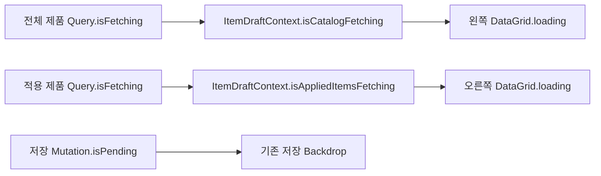

# 공정흐름 제품관리 로딩 상태 분리 설계

## 배경

공정흐름 상세관리의 제품관리 탭은 왼쪽의 전체 제품 목록과 오른쪽의 적용된 제품 목록을 서로 다른 쿼리로 조회한다. 현재 두 DataGrid는 `ItemDraftContextValue.isLoading` 하나를 공유하며, Provider는 아래 두 상태를 OR 연산하여 이 값을 만든다.

- 전체 제품 카탈로그 조회의 `isLoading`
- 적용된 제품 조회의 `isLoading`

이 구조에서는 전체 제품만 조회 중이어도 적용된 제품 DataGrid가 로딩 중으로 표시된다. 적용된 제품 행이 이미 화면에 있어도 동일한 공유 상태 때문에 선형 프로그레스가 나타난다.

## 목표

- 전체 제품과 적용된 제품의 조회 상태를 독립적으로 표현한다.
- 최초 조회뿐 아니라 검색, 페이지 이동, 명시적 재조회 중에도 해당 영역에만 선형 프로그레스를 표시한다.
- 캐시된 데이터나 기존 행이 화면에 남아 있어도 해당 영역이 실제로 재조회 중이면 프로그레스를 표시한다.
- 두 쿼리가 동시에 실행될 때만 양쪽 DataGrid에 프로그레스를 표시한다.

## 비목표

- 저장 mutation의 `isPending` 및 저장 Backdrop 동작은 변경하지 않는다.
- 오류 메시지와 재시도 UI를 영역별로 분리하지 않는다.
- React Query의 query key, 캐시 시간, 활성화 조건을 변경하지 않는다.
- 공정관리 탭의 로딩 상태 구조를 변경하지 않는다.
- API 또는 백엔드 동작을 변경하지 않는다.

## 설계 결정

`ItemDraftContextValue`의 공유 `isLoading`을 다음 두 필드로 교체한다.

```ts
isCatalogFetching: boolean;
isAppliedItemsFetching: boolean;
```

이름에 `Fetching`을 사용하여 React Query의 상태 의미와 일치시킨다. `isLoading`은 데이터가 없는 최초 로딩에 집중하지만, `isFetching`은 최초 조회와 백그라운드 재조회를 모두 포함한다. 사용자가 선택한 요구사항은 검색, 페이지 이동, 재조회를 포함한 모든 네트워크 조회 중 표시이므로 `isFetching`이 적합하다.

### 상태 매핑

| 데이터 영역 | React Query 원천 | Context 필드 | DataGrid `loading` |
|---|---|---|---|
| 전체 제품 | `queries.itemCatalog.isFetching` | `isCatalogFetching` | 왼쪽 DataGrid |
| 적용된 제품 | `queries.items.isFetching` | `isAppliedItemsFetching` | 오른쪽 DataGrid |

Provider는 두 상태를 결합하지 않는다. 각 DataGrid는 자신이 표시하는 데이터의 조회 상태만 구독한다.

## 데이터 흐름



## 표시 동작

두 DataGrid의 로딩 오버레이는 행 유무와 관계없이 기존에 적용한 `linear-progress` 설정을 유지한다.

| 전체 제품 fetching | 적용 제품 fetching | 왼쪽 프로그레스 | 오른쪽 프로그레스 |
|---|---|---|---|
| `false` | `false` | 숨김 | 숨김 |
| `true` | `false` | 표시 | 숨김 |
| `false` | `true` | 숨김 | 표시 |
| `true` | `true` | 표시 | 표시 |

적용된 제품 목록에 기존 행이 표시된 상태에서 전체 제품 검색이나 페이지 이동이 발생하면 왼쪽에만 프로그레스가 표시되어야 한다.

## 오류 및 재시도

이번 변경은 로딩 상태만 분리한다. 기존의 통합 오류 표시와 `retry` 함수는 유지한다. 재시도가 두 쿼리를 동시에 호출하면 두 쿼리 모두 실제로 fetching 상태가 되므로 양쪽 프로그레스가 표시되는 것이 올바른 동작이다.

## 컴포넌트 계약 변경

`ItemDraftContextValue` 소비자는 더 이상 `isLoading`을 사용하지 않는다.

```ts
export type ItemDraftContextValue = {
  // 기존 데이터 및 편집 계약
  isCatalogFetching: boolean;
  isAppliedItemsFetching: boolean;
  isSaving: boolean;
  // 나머지 기존 계약
};
```

`ProcessFlowDetailProvider`는 `queries.items.isFetching`과 `queries.itemCatalog.isFetching`을 각각 구조 분해하여 Context 값에 전달한다. `ProcessFlowItemTab`은 왼쪽과 오른쪽 DataGrid의 `loading` 속성을 각각 대응 필드에 연결한다.

## 테스트 전략

### Provider 계약 테스트

- 전체 제품 쿼리만 fetching이면 `isCatalogFetching=true`, `isAppliedItemsFetching=false`인지 검증한다.
- 적용 제품 쿼리만 fetching이면 `isCatalogFetching=false`, `isAppliedItemsFetching=true`인지 검증한다.
- 두 상태가 OR 연산으로 다시 결합되지 않는지 검증한다.

### 제품 탭 렌더링 테스트

- `catalog=true`, `applied=false`이면 왼쪽에만 선형 프로그레스가 나타난다.
- `catalog=false`, `applied=true`이면 오른쪽에만 선형 프로그레스가 나타난다.
- 두 값이 모두 `true`이면 양쪽에 선형 프로그레스가 나타난다.
- 두 값이 모두 `false`이면 프로그레스가 나타나지 않는다.
- 행이 없는 최초 조회에서도 스켈레톤 대신 선형 프로그레스가 유지된다.

### 회귀 검증

- 공정흐름 상세관리 관련 프런트엔드 테스트를 실행한다.
- 프런트엔드 프로덕션 빌드로 TypeScript Context 소비자 누락을 검출한다.

## 예상 변경 파일

- `frontend/src/pages/BaseData/ProcessFlowManagement/detail/ItemDraftContext.tsx`
- `frontend/src/pages/BaseData/ProcessFlowManagement/detail/ProcessFlowDetailProvider.tsx`
- `frontend/src/pages/BaseData/ProcessFlowManagement/components/ProcessFlowItemTab.tsx`
- 위 계약과 렌더링을 검증하는 관련 테스트 파일

## 인수 조건

- 전체 제품 조회만 진행 중일 때 적용된 제품 DataGrid에는 프로그레스가 나타나지 않는다.
- 적용된 제품 조회만 진행 중일 때 전체 제품 DataGrid에는 프로그레스가 나타나지 않는다.
- 검색, 페이지 이동, 재조회 동안 해당 쿼리 영역에 선형 프로그레스가 나타난다.
- 기존 행이 있는 재조회에서도 해당 영역의 선형 프로그레스가 나타난다.
- 저장 로딩, 오류 표시, 재시도, 데이터 편집 및 저장 동작은 기존과 동일하다.
- 관련 테스트와 프런트엔드 프로덕션 빌드가 통과한다.
