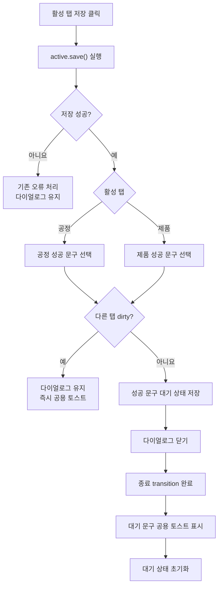

# 공정흐름 상세관리 저장 완료 토스트 설계

## 배경

공정흐름 상세관리 다이얼로그에는 `공정 관리`와 `제품 관리` 탭이 있다. 사용자는 현재 탭을 저장한 뒤 성공 여부를 공용 토스트로 확인해야 한다.

저장 후 화면 동작은 다른 탭의 미저장 변경 여부에 따라 달라진다.

- 다른 탭이 dirty이면 다이얼로그를 유지하고, 열린 다이얼로그 위에 성공 토스트를 표시한다.
- 다른 탭이 clean이면 다이얼로그를 완전히 닫은 다음 성공 토스트를 표시한다.

## 목표

- 공정 저장 성공 시 `공정 저장이 완료되었습니다.` 성공 토스트를 표시한다.
- 제품 저장 성공 시 `제품 저장이 완료되었습니다.` 성공 토스트를 표시한다.
- 다른 탭이 dirty이면 다이얼로그가 열린 상태에서 토스트를 표시한다.
- 다른 탭이 clean이면 다이얼로그 종료 애니메이션이 완료된 다음 토스트를 표시한다.
- 저장 실패 시 기존 오류 처리와 다이얼로그 유지 동작을 보존한다.

## 비목표

- 두 탭을 한 번에 저장하는 기능은 추가하지 않는다.
- dirty 계산 방식, 저장 API 또는 응답 형식은 변경하지 않는다.
- 공용 `ToastProvider`의 전역 동작과 표시 위치는 변경하지 않는다.
- 수동 닫기 및 미저장 변경 확인 동작은 변경하지 않는다.

## 동작 규칙

| 활성 탭 | 저장 결과 | 다른 탭 dirty | 다이얼로그 | 성공 토스트 |
|---|---|---:|---|---|
| 공정 관리 | 성공 | `true` | 유지 | 열린 상태에서 `공정 저장이 완료되었습니다.` |
| 공정 관리 | 성공 | `false` | 닫기 | 닫힘 완료 후 `공정 저장이 완료되었습니다.` |
| 제품 관리 | 성공 | `true` | 유지 | 열린 상태에서 `제품 저장이 완료되었습니다.` |
| 제품 관리 | 성공 | `false` | 닫기 | 닫힘 완료 후 `제품 저장이 완료되었습니다.` |
| 어느 탭이든 | 실패 | 무관 | 유지 | 성공 토스트 없음 |

## 설계

### 저장 성공 처리

`ProcessFlowDetailDialog`의 저장 액션은 기존처럼 활성 탭의 `save(): Promise<boolean>`을 호출한다. 반환값이 `false`이면 추가 작업 없이 종료해 기존 오류 토스트와 다이얼로그 유지 동작을 보존한다.

반환값이 `true`이면 활성 탭에 따라 성공 문구를 선택하고 다른 탭의 dirty 상태를 확인한다.

- 다른 탭이 dirty이면 공용 `showToast`를 즉시 호출한다.
- 다른 탭이 clean이면 성공 문구를 닫힘 이후 표시할 대기 상태로 저장하고 부모 `onClose`를 호출한다.

### 다이얼로그 종료 후 토스트

다이얼로그가 닫히는 분기에서는 `onClose` 직후 토스트를 호출하지 않는다. React 상태 업데이트와 Material UI 종료 애니메이션이 겹치면 토스트가 닫히는 중인 다이얼로그 위에 노출될 수 있기 때문이다.

대기 중인 성공 문구는 Material UI 다이얼로그의 transition 종료 콜백에서 공용 `showToast`로 표시한다. 표시한 뒤 대기 상태를 비워 재사용 시 중복 토스트가 발생하지 않게 한다.

수동 닫기에는 성공 문구를 대기시키지 않으므로 종료 콜백이 실행되어도 토스트를 표시하지 않는다.

### 상태와 책임

- 각 draft context는 저장 수행과 성공 여부 반환을 계속 담당한다.
- 상세 다이얼로그 액션은 활성 탭, 다른 탭의 dirty 여부와 성공 문구를 결정한다.
- 상세 다이얼로그 shell은 닫힘 이후 표시할 문구와 transition 종료 시점을 관리한다.
- 공용 `ToastProvider`는 기존 인터페이스와 화면 위치를 그대로 사용한다.

## 흐름

## 오류 처리

- 유효성 검사 또는 API 저장이 실패하면 각 draft context가 기존 오류 토스트를 표시하고 `false`를 반환한다.
- `false` 반환 시 성공 토스트를 예약하거나 다이얼로그를 닫지 않는다.
- 다른 탭의 dirty 여부는 실패 처리에 영향을 주지 않는다.

## 테스트

상세 다이얼로그 컴포넌트 테스트에서 다음 동작을 검증한다.

1. 공정 저장 성공 및 제품 탭 dirty: 다이얼로그 유지 후 공정 성공 토스트 표시
2. 제품 저장 성공 및 공정 탭 dirty: 다이얼로그 유지 후 제품 성공 토스트 표시
3. 공정 저장 성공 및 다른 탭 clean: 다이얼로그 닫기 전 성공 토스트 미표시, transition 종료 후 공정 성공 토스트 표시
4. 제품 저장 성공 및 다른 탭 clean: 다이얼로그 닫기 전 성공 토스트 미표시, transition 종료 후 제품 성공 토스트 표시
5. 저장 실패: 다이얼로그 유지 및 성공 토스트 미표시
6. 수동 닫기: transition 종료 후에도 성공 토스트 미표시
7. 기존 dirty 확인 다이얼로그와 저장 중 닫기 차단 테스트 유지

관련 공정흐름 상세관리 테스트와 프런트엔드 프로덕션 빌드도 함께 실행한다.

## 예상 변경 파일

- `frontend/src/pages/BaseData/ProcessFlowManagement/components/ProcessFlowDetailDialog.tsx`
- `frontend/src/pages/BaseData/ProcessFlowManagement/components/ProcessFlowDetailDialog.test.tsx`

Provider, context, 서비스와 백엔드는 변경하지 않는다.

## 인수 조건

- 공정과 제품 저장 성공 토스트가 지정된 문구로 표시된다.
- 다른 탭이 dirty이면 토스트 표시 시점에도 상세 다이얼로그가 열려 있다.
- 다른 탭이 clean이면 상세 다이얼로그 종료 transition이 끝난 뒤 토스트가 표시된다.
- 저장 실패 시 성공 토스트와 자동 닫기가 발생하지 않는다.
- 수동 닫기에서는 저장 성공 토스트가 발생하지 않는다.
- 기존 저장, dirty 표시, 미저장 확인과 오류 처리 동작에 회귀가 없다.
