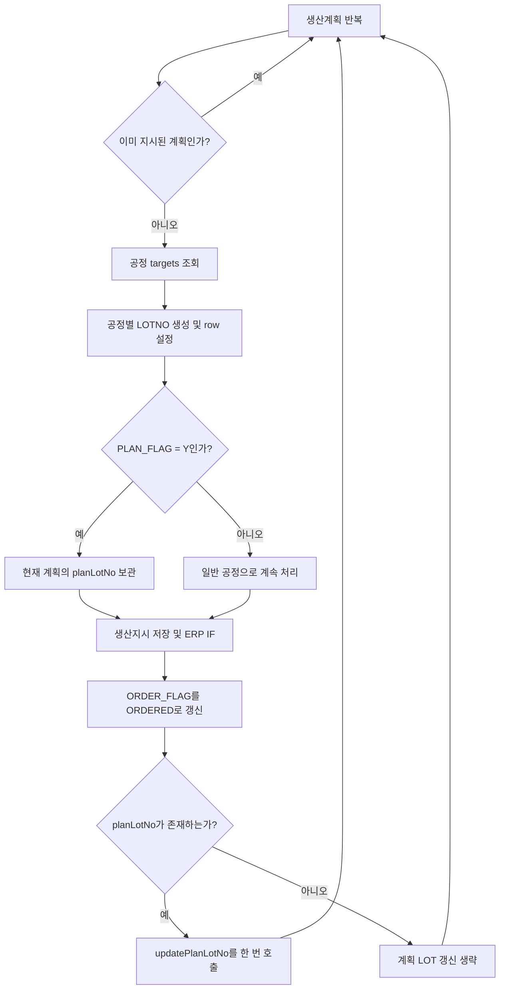

# 대량 생산지시 계획 LOT_NO 저장 설계

## 목적

`EgovProductionOrderServiceImpl.bulkCreateProductionOrders`가 여러 생산계획의 생산지시를 생성할 때, 각 공정 흐름에서 유일한 `PLAN_FLAG='Y'` 공정의 LOTNO를 해당 생산계획에 저장한다.

단건 저장 메서드인 `insertProductionOrders`와 동일하게 기존 `updatePlanLotNo(...)`를 사용하여 다음 컬럼을 갱신한다.

- `TPR301.LOT_NO`
- `TPR301M.ITEM_LOT_NO`

## 현재 흐름

대량 생산지시는 선택된 생산계획별로 다음 작업을 수행한다.

1. 이미 지시된 계획을 제외한다.
2. `findInsertTargets(plan)`으로 공정 목록을 조회한다.
3. 각 `ProdOrderRow`에 LOTNO를 채번한다.
4. `createProductionOrders(plan, targets)`로 생산지시를 저장한다.
5. ERP IF를 전송한다.
6. 생산계획의 `ORDER_FLAG`를 `ORDERED`로 갱신한다.

공정 조회 결과인 `ProdOrderRow`에는 이미 `planFlag`가 포함되어 있으므로 프런트 요청이나 `ProdPlanKeyDto`를 변경할 필요가 없다.

## 승인된 설계

각 생산계획 반복문의 LOT 채번 구간에 계획 LOT를 보관하는 지역변수 `planLotNo`를 둔다.

각 공정의 LOTNO를 생성해 `row.setLotNo(lotNo)`로 설정한 직후 `row.getPlanFlag()`가 `"Y"`이면 해당 LOTNO를 `planLotNo`에 저장한다. 한 공정 흐름에는 `PLAN_FLAG='Y'` 공정이 정확히 하나만 존재하므로 충돌 처리나 복수 값 조합은 하지 않는다.

생산지시 저장과 `updatePlanOrderFlag(..., "ORDERED")`가 끝난 뒤 `planLotNo`가 null 또는 빈 문자열이 아닐 때만 다음 호출을 한 번 수행한다.

```java
updatePlanLotNo(
        plan.getProdplanDate(),
        plan.getProdplanSeq(),
        plan.getProdworkSeq(),
        planLotNo
);
```

계획별 지역변수를 사용하므로 여러 생산계획을 한 번에 처리해도 LOTNO가 다른 계획으로 넘어가지 않는다.

## 데이터 흐름



## 예외 및 경계 조건

- `PLAN_FLAG='Y'` 공정이 누락된 계획은 생산지시 저장과 `ORDERED` 갱신을 유지하고 계획 LOT 갱신만 생략한다.
- 이미 지시된 계획은 현재 동작대로 전체 처리를 건너뛴다.
- 공정 목록이 비어 있으면 현재 동작대로 `BizException`을 발생시킨다.
- ERP IF 전송 실패 또는 예외는 현재 동작대로 `erpIfFailed`에 반영하며 MES 저장 트랜잭션을 중단하지 않는다. 계획 LOT 갱신도 계속 수행한다.
- 신규 DAO 메서드, DB 컬럼, 프런트 필드, 공통 리팩터링은 추가하지 않는다.

## 테스트 설계

`EgovProductionOrderServiceImplTest`에 대량 생성 전용 테스트를 추가한다.

1. 일반 공정과 `PLAN_FLAG='Y'` 공정이 섞인 계획에서 계획 공정의 LOTNO만 `updateProdPlanLotNo`와 `updateProdPlanLotNo2`로 전달되는지 검증한다.
2. 여러 계획을 한 번에 처리할 때 각 계획 키와 각 계획의 LOTNO 조합이 서로 섞이지 않는지 검증한다.
3. `PLAN_FLAG='Y'` 공정이 없는 계획은 두 LOT 갱신 DAO 메서드를 호출하지 않는지 검증한다.
4. ERP IF 전송이 실패해도 계획 LOT 갱신이 수행되고 반환값 `erpIfFailed`가 `true`인지 검증한다.

테스트는 LOT 채번 서비스, DAO ID 채번, 생산지시 저장, ERP IF를 Mockito로 격리하고 `ProdPlanLotNoDto` argument를 캡처하여 계획 키와 LOTNO를 직접 비교한다.

## 변경 범위

- 수정: `backend/src/main/java/egovframework/let/production/order/service/impl/EgovProductionOrderServiceImpl.java`
- 수정: `backend/src/test/java/egovframework/let/production/order/service/impl/EgovProductionOrderServiceImplTest.java`

현재 작업 트리의 기존 미커밋 변경은 보존하며 위 메서드와 관련 테스트만 최소 수정한다.
